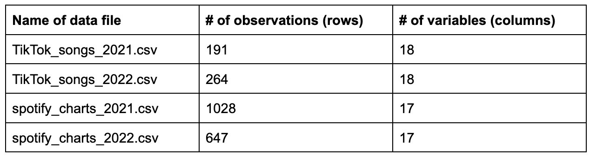

- Code Name: TikTok-music
- Project Title: Knock, Knock It’s TikTok: Examining TikTok’s Role in Changing the Music Industry
- Affiliation: INFO-201: Technical Foundations of Informatics- The Information School -University of Washington
- Quarter: Autumn 2022

## Abstract
Our main question is “How does TikTok influence music trends?” This question is important because social media is constantly changing the music industry. To address the question, we will evaluate numerous databases to compare music trends on TikTok vs. Spotify and by observing popular songs and artists.

## Key Words
- Overlap
- Popular
- Ranking

## Introduction
Now that we have gathered our datasets and brainstormed various research questions, we have begun compiling our findings into tables and other visualizations such as graphs, and charts. We mainly tried to focus on the overlap of popular songs/artists on TikTok and on the Spotify Charts. We utilized their rankings to compare their success on each platform. From doing this analysis, we have gotten a better idea on how the music industry influences music on TikTok and vice versa. We created a table that includes aggregated data from our datasets and used this table to help construct our visualizations. The main focus of our visualizations was to show how much overlap there is for songs between the two apps generally and on a more specific scale. 

## Problem Domain

- Who are the stakeholders?
As we do an in depth analysis of popular music on TikTok and Spotify it is important to question the meaning of this analysis. We may ask who is benefiting from our findings and when/if our data will ever be utilized. Besides the average person's curiosity, our work can be very beneficial to music artists who are just getting started/have a small following. They can use our data to determine if they should release their new single first on TikTok or on Spotify or the other way around. If they notice a correlation between songs that do well on TikTok vs on Spotify, they can examine what these songs are like and what made them blow up. The source playlist push confirms this idea and writes that "Smaller Indie Artists are generating substantial streaming growth from TikTok. Proof that success from TikTok comes in different sizes and can work for artists of all types (and budgets)." As for already established artists, they can observe which of their songs are blowing up on TikTok and why. They can try promoting their song to be streamed on Spotify by engaging with the different trends that are using their song  on TikTok.

- Why does music on TikTok matter?
Music on TikTok matters because most videos contain music. The whole idea of TikTok is that you can play around with filters, try new challenges, or participate in dance trends with the common theme being music in the background. TikTok is known for blowing people up such as famous influencer Charli D'amelio who found overnight success from a single dancing video. But, TikTok is also responsible for the fame of many smaller artists whose songs became popular sounds. The source acclaim writes that "TikTok is a breeding ground for sleeper hits, and StaySolidRocky’s “Party Girl” is the perfect example. The Virginia rapper first teased the song 10 months ago, and it failed to chart on its initial release." However months later, a TikToker choreographed a dance to it and it blew up on the BillBoard charts. Many small artists and dancers become famous solely because of the music on TikTok. 

- Harms and benefits of music on TikTok vs Spotify
The benefits of being a famous music artist are certainly undeniable. Popular singers get awesome sponsors, have the opportunity to travel the world on tour, and of course live very lavishly because of their huge income. However, it is important to note the differences of being famous on TikTok vs in the real music industry (finding success on Spotify). Since artists blow up instantly on TikTok it can be hard for them to find consistent success and balance their new found fame. Three Penny Press says "Becoming a celebrity in the span of a couple of months can have its negative effects. These TikTok influencers are mainly teens and young adults, so it’s hard to be put in that position of celebrity status in such a short amount of time when they are so young to begin with." They also mention that becoming famous on TikTok isn't as hard as becoming famous in the real world which is why they should be considered influencers and not celebrities.

## Research Questions
- For songs that are popular on both TikTok and Spotify, how do they rank on each?
This is an important question to ask because we may wonder if the #1 song on TikTok would also be the #1 song on Spotify. This question is motivated by trying to find a correlation between the success of songs and artists on TikTok and on Spotify.

- Do certain artists do well on both TikTok and Spotify?
This is an important question to ask because we can use the data to determine if artists mainly do better on one platform vs both. It is motivated by trying to see if the songs that do well on both are similar and what they have in common.

- What kind of overlap is there between popular songs on TikTok and Spotify charts?
This is an important question to ask because it can help us understand if there are a lot of songs that do well on both apps. It is motivated by determining if the success of songs on one app has any impact on the success of the same songs on the other app.

## The Data Set

Our problem domain considers how the popularity of songs on TikTok vs on the Spotify charts. In order to address this question, we have collected a dataset with a variety of databases.

For our first question we can use the TikTok and Spotify data sets from both years to examine their popularity. Specifically we can look at the columns peak_rank, artist_pop and track_pop to see their rankings for each app.

For our second research question, we should again utilize all the datasets to examine which artists are popular on both Spotify and TikTok. We can create a table to show which songs are popular on both apps and then filter this data to find artists who have multiple songs.

For our third research question we can use all of the datasets to discover what kind of overlap there is between popular songs on TikTok and on Spotify charts. We can do so by joining the tables based on the common song titles.



This data was collected by Sveta 151 on GitHub in August of 2022 for a personal project that considers how TikTok is changing the music industry and how trends songs on TikTok social media influence global top charts.They used a collection method to gather popular songs in TikTok for 2019, 2020, 2021, and 2022 using Spotify API. They explain that Spotify does not provide all popular songs from previous years; it also updates weekly top week charts. So, to get this information, they had to look at other sources. To do so, they performed web scraping using BeautifulSoup. Overall, the data is credible and trustworthy. We obtained this data by doing some general research for datasets on Kaggle when we stumbled upon this user and their project that has a very similar research question to ours. We credit the source of the data.

Full Citations:
-Tiktok Popular Songs 2021. Kaggle. Retrieved November 15, 2022, fromhttps://www.kaggle.com/datasets/sveta151/tiktok-popular-songs-2021

-Tiktok Popular Songs 2022. Kaggle. Retrieved November 15, 2022, from https://www.kaggle.com/datasets/sveta151/tiktok-popular-songs-2022

-Sveta151. (2022, August 29). TikTok_impact_on_the_top_charts/spotify_top_charts_21.csv at main · sveta151/tiktok_impact_on_the_top_charts. GitHub. Retrieved November 15, 2022, from https://github.com/Sveta151/TikTok_impact_on_the_top_charts/blob/main/spotify_top_charts_21.csv 

-Sveta151. (2022, August 29). TikTok_impact_on_the_top_charts/spotify_top_charts_22.csv at main · sveta151/tiktok_impact_on_the_top_charts. GitHub. Retrieved November 15, 2022, from https://github.com/Sveta151/TikTok_impact_on_the_top_charts/blob/main/spotify_top_charts_22.csv 

# Expected Implications
The expected implications from our findings are that there is overlap between popular songs on TikTok and on Spotify and that we can use this data to pick out which artists and what songs are trending. Implications may also suggest that certain artists are more popular than others and that these artists are already famous and established. This is due to the fact that small artists may blow up on TikTok but their fame may take a while to translate onto the Spotify charts if it translates at all. This is a good starting point for us and we can continue to dive deeper into this data for a more meaningful analysis in the future. Our results can be utilized by and important for app designers as it may inspire them to consider what the effects of fame can be for small singers, dancers, and other types of social media influencers.

# Limitations
Some limitations we need to address is that TikTok is a relatively new app, so there isn't a lot of data over many years that we can utilize. Or perhaps, if there is a correlation between songs popularity on TikTok and Spotify charts, it may not be distinguished yet to our eyes in the visualiztions. Another limitation we have considered is the prevelance of other apps similar to TikTok such as Instagram Reels and Youtube shorts. Although it is doubtful, there is a possibility that small artists are finding more success by using their songs on alternative social media apps these days.

# Table
The following table includes aggregated data from datasets which store information on the popular songs of TikTok and Spotify charts. 
```{r trial, echo=FALSE, message=FALSE, results='asis'}
library(knitr)
library(dplyr)
summary_table <- read.csv(file = "../source/tiktok_and_spotify_popular.csv")
kable(summary_table[1:5, ])

```

We made many different observations after analyzing our table and discovered that there can be duplicates of songs depending on the album they're from. For example, we see "Driver's License" appear twice because it is paired with the album "Sour" as well as recorded as a single. We also observed the unique columns that such as peak_rank, artist_pop, and track_pop. Peak rank is the value of the highest ranking of the song on the Spotify charts, artist_pop is the artist's popularity (higher value = more popular), and track_pop is the song's popularity. We then utilized these columns to act as rankings in future summaries and charts. This information will be very valuable in future analysis when we try to pick out exactly what songs do well on TikTok and why.

```{r echo=FALSE, message = TRUE}
num_of_songs <- nrow(summary_table)

unique_artists <- summary_table %>% 
  group_by(artist_names) %>% 
  summarise(
    artist_name = unique(artist_names)
  )
num_of_artists <- nrow(unique_artists)
pop_both <- summary_table %>% 
  filter(artist_pop >= 0)
num_of_pop_both <- nrow(pop_both)

artist_trend <- summary_table %>% 
  filter(artist_pop >= 0) %>% 
  summarise(
    artist_names = unique(artist_names)
  )
num_of_trending_artists <- nrow(artist_trend)

most_popular_artist <- summary_table %>% 
  group_by(artist_names) %>% 
  summarize(
    num_of_songs =  length(unique(track_name))
  ) %>% 
  filter(num_of_songs == max(num_of_songs)) 

most_popular_artist_name <- most_popular_artist %>% 
  pull(artist_names)

most_popular_artist_song_num <- most_popular_artist %>% 
  pull(num_of_songs)

```

# Dynamic Paragraph
For our data analysis, we took a look at data from 2020 to 2021 regarding popular songs on TikTok vs. the Spotify Charts. We analyzed `r num_of_songs` songs and `r num_of_artists` artists in total. We found there to be `r num_of_pop_both` songs that were trending on Spotify and TikTok. We then wondered how many artists were trending on Tiktok but not on the Spotify charts and found this number to be `r num_of_trending_artists`. The most popular artist trending on TikTok was `r most_popular_artist_name` and she had `r most_popular_artist_song_num` songs in total on the app.

## Charts
1)
```{r echo = FALSE}
source("../source/tt_and_spotify.R")
```

This first chart displays the relationship between the popularity of songs on TikTok vs. on Spotify in 2021. The data comes from a table which contains songs that are popular on both TikTok and Spotify separately which are then organized and plotted using ggplot. We included this chart because we can directly compare how popular songs are on TikTok and on Spotify just by looking at the graph. In the future we can use an interactive graph like plotly so that we can hover over points and see their exact values. We can also consider filtering this data to be focused on a certain artist, or range of peak ranks if we need that information later on. 

2)
```{r echo = FALSE}
source("../source/trending_artists.R", local = TRUE)

trending_artists
```

The second chart displays the relationship between an artist and the amount of songs they have that are popular on both Spotify and Tiktok in 2022. We can see that Doja Cat has the most trending songs in this case while Ed Sheeran has the least. We included this graph because it is important to note the artists whose songs do well on both Spotify and TikTok. Are these artists similar or different in anyway? In the future, we can implement a toggle feature so that we can choose which artists we want to compare in the visualization as well as possibly include the names of the songs that the artists have trending.

3)
```{r echo = FALSE}
source("../source/pie_tt_spotify_22.R")

```

The third and last chart considers whether songs are on both Spotify and TikTok. The results showed that 93% of songs are not on both Spotify and Tiktok while 7% are. This is helpful information because it answers the question, are the same songs popular/trending on TikTok and Spotify? We may consider diving deeper into the 7% in P3 and trying to find what these songs are, who wrote them, and if they have anything in common.

# References
- Acclaim. (2020, June 10). 6 viral TikTok songs that changed artists' lives. Acclaim Magazine. Retrieved November 15, 2022, from https://acclaimmag.com/music/6-viral-tiktok-songs-that-changed-artists-lives/#11 

- Andry, C. S. (n.d.). Dear tiktokers, dancing to trends does not equal celebrity status. Three Penny Press. Retrieved November 15, 2022, from https://threepennypress.org/opinions/2021/11/05/dear-tiktokers-dancing-to-trends-does-not-equal-celebrity-status/#:~:text=Gaining%20a%20lot%20of%20followers,not%20make%20these%20influencers%20celebrities. 

- Mitchell-Hardt, A. (2022, October 23). Do tiktok views lead to Spotify streams? Six things every artist needs to know. Playlist Push. Retrieved November 15, 2022, from https://playlistpush.com/blog/do-tiktok-views-lead-to-spotify-streams-four-things-every-artist-needs-to-know/ 

# Appendix A: Questions
- Are the suggestions for the future we made for the charts feasible?
- We wanted to take a look at how popular older songs or remixes of older songs are on TikTok and on spotify but the only way we filter those songs is manually. Would this be ok if we just looked at around 50-100 rows?

