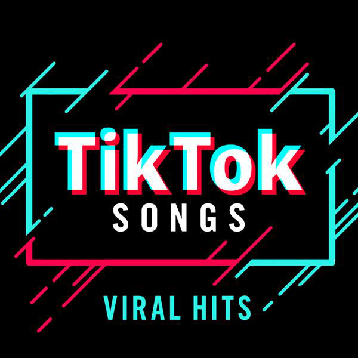

# Knock, Knock It’s TikTok: Examining TikTok’s Role in Changing the Music Industry

### Code name

TikTok-music

### Authors

Mie Dunbar (dunbar11@uw.edu),
Xenia Capcan (capcax@uw.edu),
Kim Nguyen (kimng@uw.edu)

### Keywords

- Music trends
- TikTok
- Artists
- Social media

## Introduction
Since the introduction of TikTok in 2018, it has had an undeniable impact on the music industry. Songs that once were just trending audio on the social media app quickly become number-one hits on certified music charts, such as Billboard; artists who previously only had a small audience have been launched into mainstream culture and have seemingly secured their spot as a household name. While it is easy to focus on who reaped the benefits of their songs getting popular, there seems to be less attention on what gets popular. With the relationship between social media and music strengthening with each passing year, we wanted to take a closer look at how the music landscape has shaped to accommodate the growing audience. To do this, we will be comparing multiple data sets from different platforms (TikTok trending audios, Billboard Charts, Spotify, etc.) in an effort to visualize the relationship between said platforms, as well as the impact of social media in the music industry.

## Problem Domain

**_What Are We Looking At?_**

The analysis of our project will be critical in understanding today’s music industry. We want to be able to ask the right questions to find the answers we are looking for. For example, we are curious about TikToks role in artists’ road to fame. If you were to make it big on TikTok, does this translate to your success on the Billboard charts? The Pudding has done more in depth research on this and concluded that “Of the artists who charted on Spotify from January 2020 to December 2021, 332 had never charted before. 25% of them came from TikTok.” From this main idea, we can begin to see that the direct stakeholders are new artists who are using TikTok as a promotional tool for their craft, and the indirect stakeholders are the previously established musicians who are competing with them, as well as the audience of music listeners. 

**_Societal Setting_**

With TikTok’s large social presence, it is important to take a step back and evaluate how it influences our lives. The app grew rapidly and can be addictive to many young people, who are at a point in life to begin to influence society as a whole. By examining how it affects the music industry, we are taking the first step into seeing how it influences our lives as a whole. Does the app align with our values? What makes it so addictive? Why do we blow up songs/remixes on the app but not on the charts? Is it because of the dance trends that go with the music? Product Lessons writes “Not only is music a useful content discovery vector, but a video synchronized to music can hook people in and transcend borders. A video shared from Japan may not typically take off in Germany and the US, but paired with a catchy tune it can, resulting in stronger network effects. Music finds its way into our heads, inspires us to do TikTok challenges, and even anoints new stars. Just ask Lil Nas X whose “Old Town Road” song first blew up on TikTok before racing up official music charts.”

**_Looking Ahead_**

It should be noted that some of the specific examples presented in this project will soon become irrelevant in a couple of years due to the fast-paced nature of internet trends. This idea is best said by Conscious Life and Style, who states that “Fashion trends are everywhere and they have only gotten faster over time. Trends are not necessarily always negative, but they have become a key driver of unsustainable speed, consumption, and waste in the fashion industry”. This concept can hypothetically be applied to music and artists as well. How have the ways that audiences consume music have changed? How is that affecting small-named artists, who get their first and only break through TikTok as audiences move onto the next big thing in a week? How is this fast-paced competition forcing established artists to change? On the other hand, TikTok can be an effective way to give said small artists a dedicated listening base, as well as bring back some classics from established artists. It all depends on the tight-knit relationship between social media and the industry.

## Research Questions

1. Do the songs trending on Tiktok correlate with songs that are on top of the national music charts?

The significance of this question for our research is that, if the answer is "yes," it will have an impact on both the present and future of music production and streaming.

2. Is  TikTok responsible for repopularizing songs from the past?

This question is important because recent music that is popular contains songs from the past that have been remixed or redone.
TikTok motivates this question because it forces us to wonder if these redone songs are only at the top of the charts because of how well they’ve done on TikTok. Are TikTok influencers and dancers the ones responsible for the success of these songs?

3. Are more artists releasing sped-up versions of their own songs after the boom of TikTok’s popularity?

This question is important because the audio that tends to gain popularity are sped-up versions of the original song.
The motivation behind this question is based on the monetization of streams. Because of the “sped-up” trend, one could question if artists are trying to capture as many audiences as possible, including the growing niche audience of people who like listening to faster-paced songs.

## The Dataset

Our problem domain considers how TikTok is influencing the music industry. In order to address this question, we have collected a dataset with a variety of databases.

For our first question we can use the TikTok Trending Tracks data set as well as the Billboard Top Hits or Ultimate Pop Data site to compare where older songs are ranking on social media vs. in the music industry. We can see if old songs are popular on TikTok directly translates to their popularity on the Billboard charts.

For our second research question, we should use the TikTok Popular sets database to examine past songs that are trending again. Or, we can also use the Most Popular Artists data to see which artists are “older”/becoming relevant again.

For our third research question we can use the Ultimate Pop Data site to see if artists are releasing different versions of their songs. Then we can use the TikTok Trending Tracks data to see how well the songs are doing on TikTok.

| Name of Data File    | # of observations(rows)| # of variables (columns) |
| ----------- | ----------- | |
| TikTok Popular Sets   | 258        | 18 |
| Ultimate Pop Data   | 100+       | 9 |
| Tiktok Trending Tracks | 3560 |  23|
| Most Popular Artists | 1000 | 4

## Expected Implications

The topic we chose has a fairly broad scope, and while we hope to produce insightful findings that might shed light on the state of the music business today, there may be some unintended consequences that develop as we go along and as a result of our findings. While we believe Tiktok affected music artists' popularity, there are a lot of other factors that affect how artists are ranked, particularly on a site like Billboard. While it's important to always assume that correlation does not always imply causation, we are nonetheless very confident in our analysis and will continue to carry it out. We are all in the process of learning how to analyze data and draw conclusions, and while working on this project, we will be giving it our all, despite potential obstacles and misunderstandings. But we think examining this pattern will be very instructive in demonstrating how much social media can influence music charts and even help up-and-coming artists.

## Limitations

Our biggest limitation is that the data we're analyzing is only recent, so we can't make any significant inferences about how it will affect the music industry, which has existed for centuries. It's possible that a brief period of fewer than 5 years does not foreshadow an impending change in how songs and artists are discovered. Alternatively, we think that it might also be our greatest strength because this subject is so fresh and interesting to research and see if we can find anything. Additionally, some of the data that we discover in the form of website databases—some of which are not publically accessible from websites like Tiktok itself and cannot be organized using R—could have been a more trustworthy source of information. For the time being, we are relying on the information that other people independently gathered, trusting that it is trustworthy and pertinent.

## References
Jur, M. (n.d.). Ultimate Music Database. Retrieved October 30, 2022, from http://www.umdmusic.com/

Most popular artists worldwide. songkick. (n.d.). Retrieved October 30, 2022, from https://www.songkick.com/leaderboards/popular_artists
Sveta151. (2022, August 22).

Tiktok Popular Songs 2022. Kaggle. Retrieved October 30, 2022, from https://www.kaggle.com/datasets/sveta151/tiktok-popular-songs-2022

Yam Peleg. (2021). <i>TikTok Trending Tracks</i> [Data set]. Kaggle. https://doi.org/10.34740/KAGGLE/DSV/2905511

Why TikTok is so addicting. Product Lessons. (n.d.). Retrieved October 31, 2022, from https://www.productlessons.xyz/article/why-tiktok-is-so-addicting

The Pudding. (n.d.). The unlikely odds of making it big on TikTok. The Pudding. Retrieved October 31, 2022, from https://pudding.cool/2022/07/tiktok-story/

Hertantyo, S. (2022, May 31). The impact of fashion trend cycles and trend forecasting. Conscious Life &amp; Style. Retrieved October 31, 2022, from https://www.consciouslifeandstyle.com/fashion-trend-cycles/#:~:text=Fashion%20trends%20are%20everywhere%20and,waste%20in%20the%20fashion%20industry.

**Appendix A: Questions**
_Do you have questions for your TA or instructor? Include them here._

We found some databases that we wanted to use in the project, but we don’t know how to exactly extract them into a .csv file. Are there any resources that can help?
